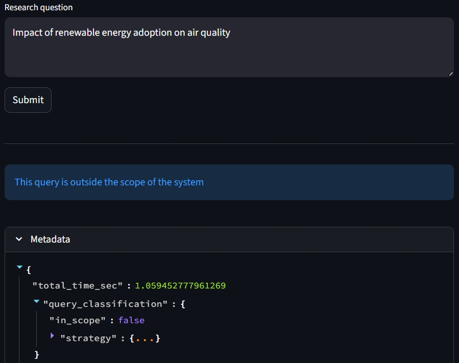

## Live Demo
**Frontend (Streamlit UI):** https://energytransitionrag.streamlit.app/<br>
**API Docs (FastAPI / Swagger):** https://energytransitionrag.onrender.com/docs<br>
⚠️ Note: The backend is hosted on a free-tier instance and may take ~30–120 seconds to wake up after inactivity.
<br><br>


## Introduction
This system helps environmental researchers and policymakers answer questions about the social impacts of renewable energy adoption by synthesizing evidence from multiple peer-reviewed research papers.<br>
Given a query, the system retrieves relevant passages from a corpus of open-access climate research, aggregates key findings, and produces a structured synthesis with explicit citations.<br>
The goal is to support evidence-based decision-making through grounded synthesis, while minimizing hallucinations and maximizing transparency.
<br><br>


## System Overview
The system follows a modular RAG pipeline:
1. **Query scope classification**
2. **Query preprocessing** (normalization, optional expansion)
3. **Hybrid retrieval**
4. **Reranking**
5. **LLM-based Relevance evaluation**
6. **Synthesis**
<br><br>
<figure align="center">
<span style="display: inline-block; width: 40%; height: 40%;">

</span>
</figure>

The backend is exposed via a FastAPI service and consumed by a Streamlit frontend.
<br><br>


## Abstention
An important feature of this system is the decision to abstain from providing a synthesized answer to the user when the query is classified as out-of-scope or the synthesizer judges the evidence which is made available to it as not sufficient to provide a satisfying synthesis.<br>
The purpose of this is to limit resource utilization (for out-of-scope queries) and prevent hallucinations and model interpolation when evidence is limited.
<br><br>
<div style="display: flex; justify-content: center; gap: 2%; align-items: flex-end;">

  <div style="text-align: center; width: 35%;">
    
    <div>Out-of-scope query</div>
  </div>

  <div style="text-align: center; width: 35%;">
    
    <div>Synthesizer abstention</div>
  </div>

</div>
<br><br>


## Tech Stack

### Backend (RAG Pipeline)
- **Document parsing**
   - pdfplumber
- **Text normalization**
   - nltk (stemming) / spaCy (lemmatization)
- **Indexing & Retrieval**
  - FAISS for vector similarity search
  - BM25 for lexical retrieval (hybrid search)
- **Embeddings**
  - OpenAI API (e.g. `text-embedding-3-small`)
  - HuggingFace models (`sentence-transformers`)
- **Reranking**
  - Cross-Encoder (`sentence-transformers`)
  - FlashRank (lightweight alternative for deployment constraints)
- **LLM & Generation**
  - OpenAI models (e.g. `gpt-4o-mini`)
  - HuggingFace models (GPU profile)
- **API Layer**
  - FastAPI

### Frontend
- Streamlit UI
- Requests-based client for API interaction

### Deployment
- Backend hosted on Render (Dockerized FastAPI service)
- Frontend deployed on Streamlit Community Cloud
<br><br>


## Limitations & Future Work
- **No conversational memory**: the system does not maintain chat history or context across queries
- **Coarse-grained grounding evaluation**: grounding is evaluated at the synthesis level rather than explicitly linked to individual claims
- **Limited evaluation framework**: the system lacks systematic benchmarking (e.g., retrieval precision, answer faithfulness)
- **No strict resource control**: no explicit handling of token limits, latency budgets, or cost optimization
- **Public deployment constraints**: the backend runs on a free-tier instance (Render), which introduces cold-start latency and memory limitations
<br><br>


## Running Locally
⚠️ Note: To run the system on your machine, you need an OpenAI API key, or a device which supports GPU.

### 1. Clone the repository
```bash
git clone https://github.com/LucaB97/EnergyTransitionRAG.git
cd EnergyTransitionRAG
```
### 2. Backend setup
If you wish, you can modify system behavior via `DEFAULT_CONFIG`, which you find in `initialization/config.py`.<br>
Install the dependencies:
```bash
pip install -r requirements.txt
pip install -r requirements_full.txt
```
Next, environmental variables must be set. You can either provide your information in a `.env` file (following the instructions in `.env.example`), or manually set them as follows.<br>
  If public profile is used:
```bash
export OPENAI_API_KEY=<your_key_here>
export OPENAI_MODEL=<chosen_model_here> #optional
```
If GPU profile is used:
```bash
export SYNTH_PROFILE=gpu
export OPENAI_API_KEY=<your_key_here> #optional (provide if openai embeddings are used)
export HF_MODEL_GPU=<chosen_model_here> #optional
```
Finally, run the API:
```bash
uvicorn main:app --reload
```
### 3. Frontend setup
```bash
cd frontend
pip install -r requirements.txt
streamlit run streamlit_app.py
```
<br><br>


## Running with Docker
### 1. Clone the repository
```bash
git clone https://github.com/LucaB97/EnergyTransitionRAG.git
cd EnergyTransitionRAG
```
### 2. Build the image
```bash
docker build -t energytransitionrag --build-arg INSTALL_FULL=true .
```
### 3. Run the container
```bash
docker run -p 10000:10000 -e OPENAI_API_KEY=your_key_here energytransitionrag
```