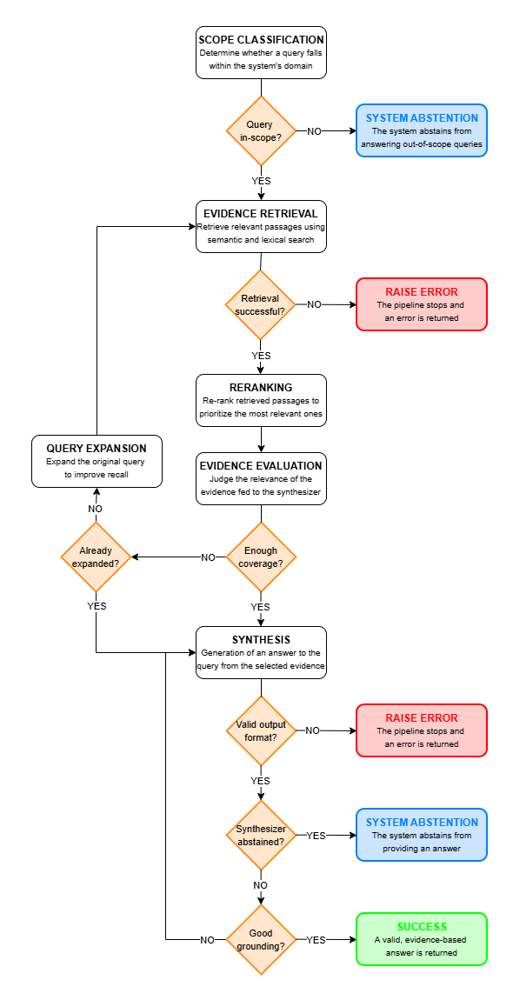
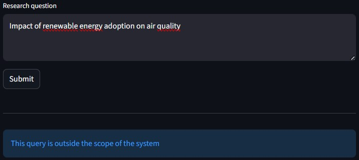
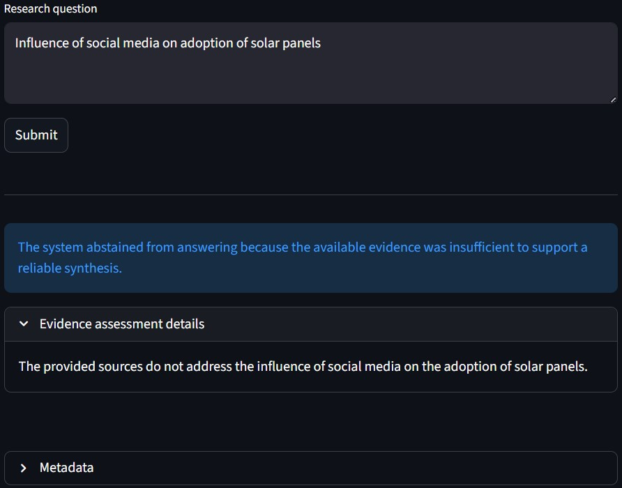

# Introduction
This system helps environmental researchers and policymakers answer questions about the social impacts of renewable energy adoption by synthesizing evidence from multiple peer-reviewed research papers. 
Given a query, the system retrieves relevant passages from a corpus of open-access climate research, aggregates key findings, and produces a structured synthesis with explicit citations. 
The goal is to support evidence-based decision-making while minimizing hallucinations and maximizing transparency.

# Requirements
To run the system on your machine, you need one of the following: 
- an OpenAI API key, or 
- a device which supports GPU.

# System setup
The required modules are found in `requirements.txt`. 
The `data` directory contains the papers from which the evidence for the synthesis will be taken, and their metadata. 
The information provided in the `.env` file determines the LLM type (OpenAI or HuggingFace) and specific model to employ in the system. 
In `initialization/config.py`, the `DEFAULT_CONFIG` object contains the implementation details for the creation of the chunks and the embeddings of chunks and queries (needed for semantic retrieval). 

# RAG Workflow
<figure align="center">

</figure>

# Abstention examples
| Out-of-scope query | Synthesizer abstention |
|--------------------|------------------------|
| 

 | 

 |

# Limitations

